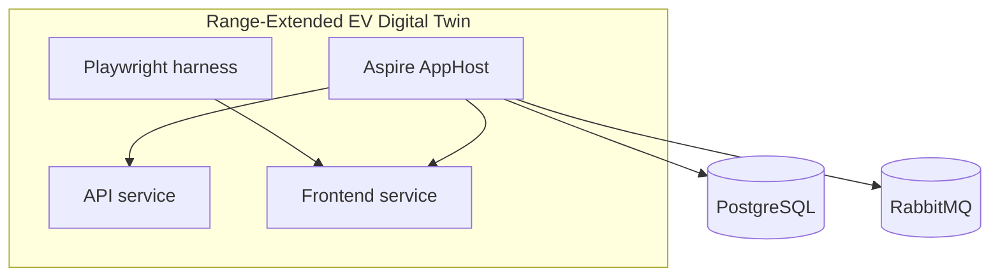

# Container diagram

```mermaid
flowchart TB
    subgraph Repo[Range-Extended EV Digital Twin]
      AppHost[Aspire AppHost]
      Api[API service]
      Frontend[Frontend service]
      Tests[Playwright harness]
    end

    AppHost --> Api
    AppHost --> Frontend
    AppHost --> Postgres[(PostgreSQL)]
    AppHost --> RabbitMQ[(RabbitMQ)]
    Tests --> Frontend
```
