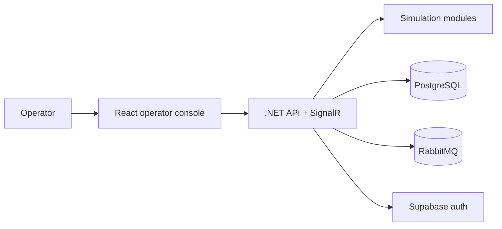

# Context diagram

```mermaid
flowchart LR
    Operator[Operator] --> Frontend[React operator console]
    Frontend --> Api[.NET API + SignalR]
    Api --> Simulation[Simulation modules]
    Api --> Postgres[(PostgreSQL)]
    Api --> RabbitMQ[(RabbitMQ)]
    Api --> Supabase[Supabase auth]
```
