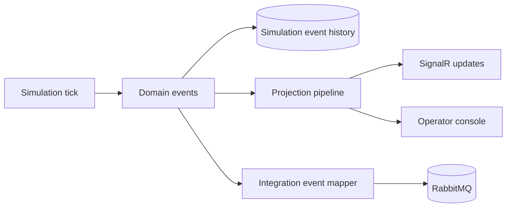

# Event flow diagram

```mermaid
flowchart LR
    Tick[Simulation tick] --> DomainEvents[Domain events]
    DomainEvents --> EventStore[(Simulation event history)]
    DomainEvents --> Projections[Projection pipeline]
    Projections --> SignalR[SignalR updates]
    Projections --> Frontend[Operator console]
    DomainEvents --> IntegrationMapper[Integration event mapper]
    IntegrationMapper --> RabbitMQ[(RabbitMQ)]
```
